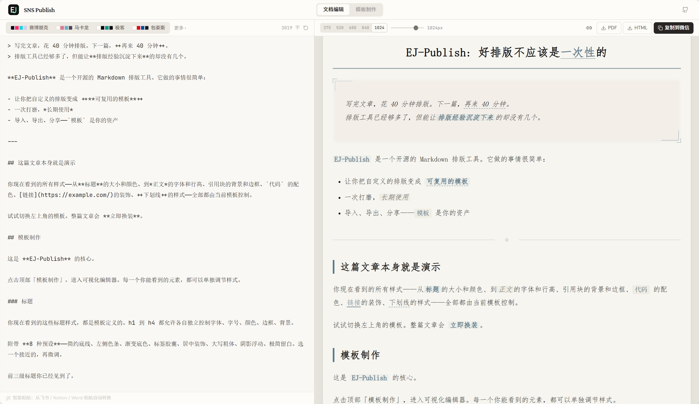
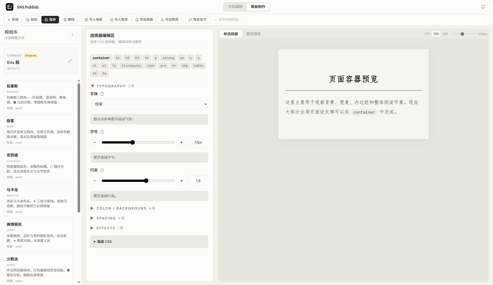

# EJ-Publish

面向内容创作者的 Markdown 排版工具。写一次模板，长期复用。

当前重点围绕微信公众号发布链路设计，同时支持 HTML / PDF 导出。

**在线体验：[publish.ej-studio.app](https://publish.ej-studio.app)**



## 为什么做这个

排版工具很多，但大多数是"一次性"的——每篇文章都要重新调整样式。

EJ-Publish 把排版经验沉淀为**可复用的模板**：可视化编辑、JSON 导入导出、Git 版本管理。一次打磨，持续使用。

## 核心能力

**模板系统**

- 可视化编辑器：标题、正文、引用、代码、分割线、图片、表格、链接、下划线——每个元素独立调节
- 标题 8 种预设、引用块 6 种预设（含直角装饰）、代码块 4 种预设、分割线 10 种符号装饰
- 高级 CSS 补充面板未暴露的细节
- 模板以 JSON 文件存储，支持导入、导出、分享



**编辑与粘贴**

- 从飞书、Notion、Word、网页粘贴富文本，自动清洗为 Markdown
- 截图直接 Ctrl+V 粘贴为图片
- 连续图片自动组成并列网格或滑动轮播
- 预览视图自由调整(320px - 1200px)

**输出**

- **复制到公众号**：自动处理微信兼容性，粘贴即保留样式
- **HTML 导出**：自包含文件，样式内联
- **PDF 导出**：按预览效果生成

> **图片与微信**：复制到公众号时，微信会抓取图片 URL 并重新托管到自己的服务器。
>
> - **公网 https 链接**（图床、Unsplash 等）：直接可用，微信能正常抓取
> - **截图粘贴 / 本地图片**：在线部署版（publish.ej-studio.app）会自动将图片上传到临时图床，生成 https 链接供微信抓取
> - **自部署用户**：需要自行部署图片代理服务（Cloudflare Worker + R2），或使用第三方图床手动获取 https 链接。代理服务的实现方式参见 `src/lib/wechatCompat.ts` 中的 `uploadToImageProxy` 函数

## 内置模板

| 模板 | 风格 |
| --- | --- |
| Eris 桓 | 作者自设，工具默认模板 |
| 极客 | 黑白高对比，青色点缀，开发者文档风 |
| 少数派 | 红色编辑线系统，中文科技媒体 |
| 克劳德 | 燕麦暖棕，衬线正文，深度长文 |
| 终端 | 深靛蓝底，IDE 绿色与橙色数据流 |
| 赛博朋克 | 品红与青的霓虹双色，未来废土 |
| 水墨 | 楷体正文，直角印章引用，中式写意 |
| 马卡龙 | 多彩马卡龙色系，甜而不腻 |
| 包豪斯 | 三原色几何碰撞，零圆角先锋 |

所有模板均可导出为 JSON，换设备时一键导入恢复。

## 快速开始

```bash
pnpm install
pnpm dev
```

浏览器打开 `http://localhost:5173`，粘贴文章，选模板，复制到公众号。

## 常用命令

```bash
pnpm dev        # 启动开发服务器
pnpm build      # 构建生产版本
pnpm test       # 运行测试
pnpm preview    # 预览构建产物
```

## 技术栈

React 18 · TypeScript · Vite 5 · Tailwind CSS 3 · markdown-it · highlight.js · turndown · html2pdf.js · framer-motion · Vitest

## 项目结构

```
src/
├── pages/
│   ├── EditorPage.tsx          # 文章编辑器
│   └── TemplatesPage.tsx       # 模板工作台
├── components/
│   ├── EditorPanel.tsx         # Markdown 输入区 + 智能粘贴
│   ├── PreviewPanel.tsx        # 实时预览面板
│   ├── Header.tsx              # 顶部导航栏
│   ├── ThemeSelector.tsx       # 模板切换选择器
│   └── Toolbar.tsx             # 导出 / 复制 / 预览控制
├── lib/
│   ├── htmlToMarkdown.ts       # 智能粘贴（富文本 → Markdown）
│   ├── markdown.ts             # 渲染与模板应用
│   ├── wechatCompat.ts         # 微信兼容 + 图片代理上传
│   ├── imageStore.ts           # 粘贴图片管理
│   ├── editorContext.tsx        # 编辑器状态管理
│   └── templates/              # 模板系统运行时
├── template-library/
│   ├── templates/              # 运行时模板（JSON）
│   └── seed/                   # 出厂模板快照
└── content/
    └── default-showcase.md     # 默认示例文档
```

## 站点

- 主站：[publish.ej-studio.app](https://publish.ej-studio.app)
- 备用：[antieris.github.io/EJ-Publish](https://antieris.github.io/EJ-Publish/)

## 许可证

Apache License 2.0 — 详见 [LICENSE](LICENSE)。

## 来源与署名

EJ-Publish 基于 [liuxiaopai-ai/raphael-publish](https://github.com/liuxiaopai-ai/raphael-publish) 进行了大量重构与改造，原项目采用 MIT License，其版权声明保留在 [NOTICE.md](NOTICE.md) 中。